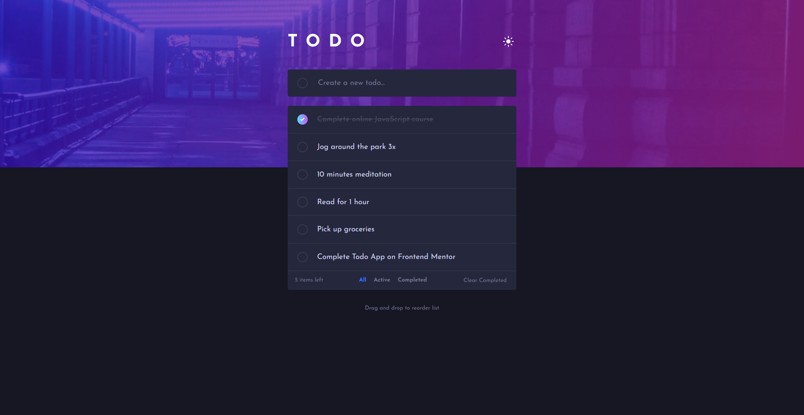

# Frontend Mentor - Todo app solution

This is a solution to the [Todo app challenge on Frontend Mentor](https://www.frontendmentor.io/challenges/todo-app-Su1_KokOW). Frontend Mentor challenges help you improve your coding skills by building realistic projects. 

## Table of contents

- [Overview](#overview)
  - [The challenge](#the-challenge)
  - [Screenshot](#screenshot)
  - [Links](#links)
- [My process](#my-process)
  - [Built with](#built-with)
  - [What I learned](#what-i-learned)
  - [Continued development](#continued-development)
  - [Useful resources](#useful-resources)
- [Author](#author)
- [Acknowledgements](#acknowledgements)

## Overview

### The challenge

Users should be able to:

- View the optimal layout for the app depending on their device's screen size
- See hover states for all interactive elements on the page
- Add new todos to the list
- Mark todos as complete
- Delete todos from the list
- Filter by all/active/complete todos
- Clear all completed todos
- Toggle light and dark mode
- **Bonus**: Drag and drop to reorder items on the list

### Screenshot



### Links

- Live Site URL: [Frontend Mentor | Todo app](https://jorge-sanchez09.github.io/todo-app-main/)

## My process

### Built with

- Semantic HTML5 markup
- CSS custom properties
- Flexbox
- CSS Grid
- JavaScript
- DragDropTouch library

### What I learned

During this challenge I remembered things about JavaScript Local Storage and Drag and Drop APIs, on which the main functionality of this project depended. 
The tasks sorting using Drag and Drop ended up a little buggy, later, I discovered that it wasn't working on my phone because drag events are not supported on many mobile devices. I found a reliable Drag and Drop polyfill library that adds mobile support, allowing me to enable task sorting on mobile devices as well. 
There was only a minor issue where the dragging task to not remove its .dragging class when touch was released, so I added an additional eventListener for the touchend event as well.

```js for the sorting
todoListEl.addEventListener('dragover', e => {
    e.preventDefault();
    e.dataTransfer.dropEffect = "move";
    const draggingItem = todoListEl.querySelector('.dragging');
    const tasksItems = Array.from(todoListEl.children).filter(task => task !== draggingItem);

    let nextSibling = tasksItems.find(sibling => e.clientY <= sibling.getBoundingClientRect().y);

    todoListEl.insertBefore(draggingItem, nextSibling);
});
```

### Continued development

I'd like to learn more details about how to manipulate the DOM using coordinates, because it was useful to make the sorting with methods like getBoundingClientRect(), also I think it would be beneficial to learn more about js libraries when stucked on a certain functionalities.


### Useful resources

- [Draggable List in JavaScript](https://www.youtube.com/watch?v=9HUlUnM3UG8&t=669s) - At first I watched this video for the tasks sorting, but later I made some changes because it wasn't working well enough for me. However, it still serves as a good example of how to implement this functionality with minimal code
- [DragDropTouch](https://github.com/Bernardo-Castilho/dragdroptouch) - I used this Drag and Drop polyfill library that provided the drag and drop mobile support, which made posible to sort the task items on mobile devices

## Author
- Frontend Mentor - [@Jorge-sanchez09](https://www.frontendmentor.io/profile/Jorge-sanchez09)

## Acknowledgements
- [Bernardo Castilho](https://github.com/Bernardo-Castilho) - Owner of the Drag and Drop polyfill library